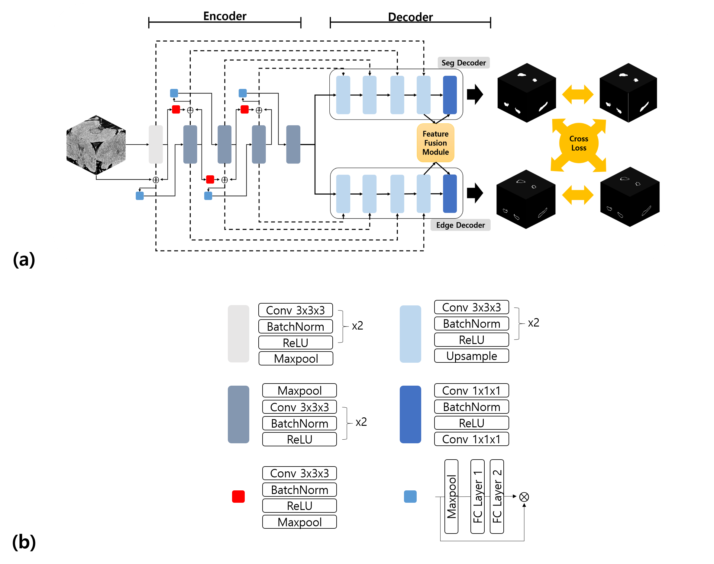

## Title: CT-Based Hippocampus Segmentation with Dual-Decoder Network (HDD-Net)
##### Author: Wonjun Son, Ji Young Lee, Sung Jun Ahn, Hyunyeol Lee

Official implementation of the MICCAI 2025 paper 'CT-Based Hippocampus Segmentation with Dual-Decoder Network (HDD-Net)'

> Dataset

Internal Dataset: Seoul Ganganm Severance Hospital (Train: 120, Test: 50)

External Dataset: Seoul St.Mary's Hospital (Test: 47)

> HDD-Net architecture

Below is an overview of the proposed dual-decoder network architecture:



> Training

To train the model, run the following command:

```bash
python main.py --model UNet --filename HDD
